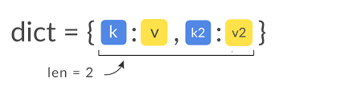

# Словари в Python

**Словарь** — это неупорядоченный набор элементов. Элемент словаря представляет собой пару ключ: значение. Словари оптимизированы для получения значений по заданному ключу.

## Методы словарей

**dict.clear()** - очищает словарь.

**dict.copy()** - возвращает копию словаря.

**classmethod dict.fromkeys(seq[, value])** - создает словарь с ключами из seq и значением value (по умолчанию None).

**dict.get(key[, default])** - возвращает значение ключа, но если его нет, не бросает исключение, а возвращает default (по умолчанию None).

**dict.items()** - возвращает пары (ключ, значение).

**dict.keys()** - возвращает ключи в словаре.

**dict.pop(key[, default])** - удаляет ключ и возвращает значение. Если ключа нет, возвращает default (по умолчанию бросает исключение).

**dict.popitem()** - удаляет и возвращает пару (ключ, значение). Если словарь пуст, бросает исключение KeyError. Помните, что словари неупорядочены.

**dict.setdefault(key[, default])** - возвращает значение ключа, но если его нет, не бросает исключение, а создает ключ со значением default (по умолчанию None).

**dict.update([other])** - обновляет словарь, добавляя пары (ключ, значение) из other. Существующие ключи перезаписываются. Возвращает None (не новый словарь!).

**dict.values()** - возвращает значения в словаре.

## Как создать словарь

*Чтобы создать словарь в Python, необходимо прописать элементы внутри фигурных скобок {} и разделить их запятыми.
В элементе содержится ключ и соответствующее значение, они записываются так: (ключ: значение).
В словарях значения могут повторяться и быть любого типа. Ключи же повторяться не могут и должны быть неизменяемым типом (строками, числовыми типами и кортежами с неизменяемыми элементами).*

```Python
a_dict = {'first': 10, 'second': -5, 'third': 6}
b_dict = {'Frig': 'milk', 'animal': 'bat'}
print(a_dict['first'])
print(b_dict['Frig'])
a_dict['boom'] = 8888
print(a_dict)
print(len(a_dict))
# for x in a_dict.items():
#     print(x)
for key, value in a_dict.items():
    print(key, value)
```
Данный код записан в Markdown в `` ` ``.
Сначала создаем список словаря ``` a_dict = {'first': 10, 'second': -5, 'third': 6} ```.  Затем мы можем вывести элемент словаря ``` print(a_dict['first']) ``` и добавить элемент в словарь ``` a_dict['boom'] = 8888 ```.



Ссылка на [GitHub](https://github.com)